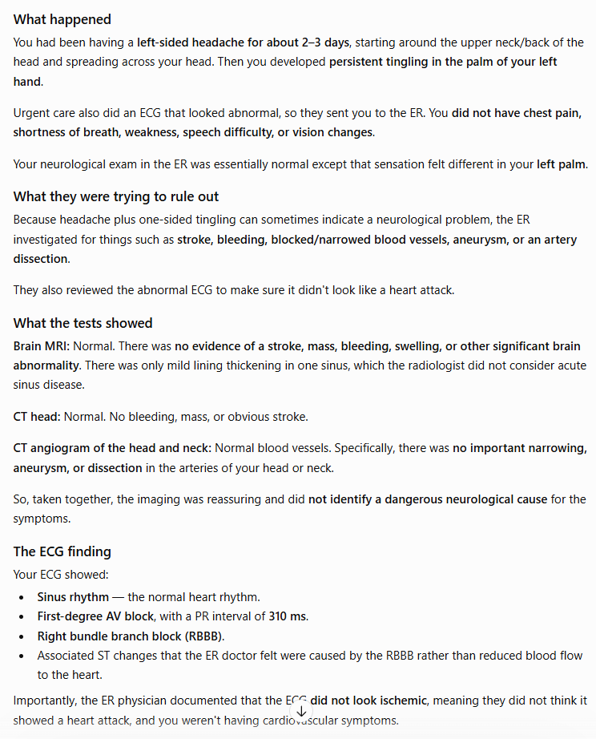
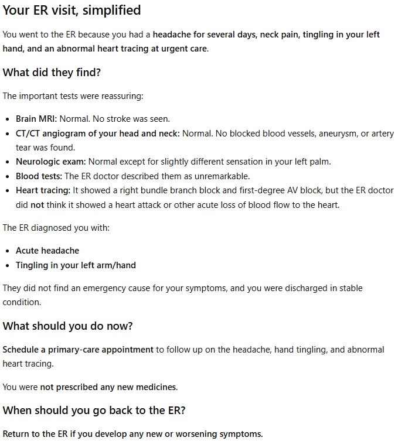

# simplify-med

An OpenAI plugin with three patient-facing skills:

- **`prep`** — before a visit: capture the appointment's stated requirements, the patient's prioritized concerns, a things-to-bring checklist, and questions to ask.
- **`simplify`** — after a visit: turn supplied clinical documents into a plain-language, source-anchored care plan with deterministic validation and an audit trail.
- **`med-lit`** — for each person: an opt-in, brief health-literacy screen (BHLS) plus self-reported support needs, returned as a basic profile.

`prep` and `med-lit` are instruction-only skills (no scripts) with basic Markdown output.

## The Problem

Patients leave appointments unsure what just happened. The paperwork they take home is long and full of jargon, and it rarely says clearly what to do next.

The research behind this plugin covers **200+ patient surveys, 50 patient interviews, and 30 clinician interviews**:

| Survey finding | Share of patients |
|---|---:|
| Understood only part of their visit, or got too little information | **57%** |
| Missed critical questions, or were too overloaded to ask them | **51%** |
| Had to contact the doctor again after the visit | **58%** |

> “I kind of go dumb when they start talking.” — patient
>
> “A thousand pages, but only two usable ones.” — clinician

Patients and clinicians described the same gaps, and each skill targets one of them:

| Gap | Patient interviews | Clinicians | Skill |
|---|---:|---:|---|
| Information overload | 71% | 95% | `simplify` |
| Unprepared for the visit | 76% | 74% | `prep` |
| Jargon and results | 62% | 79% | `med-lit` |

Headline participant counts are rounded fieldwork totals. The percentages come from the connected, de-identified corpus analysed in [`user/research-report.md`](user/research-report.md).

## Before and After

Same ER report, two results. Asking ChatGPT to simplify the raw report produces a long, dense wall of text that still uses jargon, and it goes on well past this screenshot. `simplify` produces one short page: what happened, what they found, what to do now, and when to go back.

| Before: ChatGPT on the raw report | After: `simplify` |
|---|---|
|  |  |

## Why You Can Trust the Output

- **Source-grounded.** Every fact is quoted from an exact line of the source. The writing stage never sees the raw note, only checked facts.
- **AHRQ plain language.** 299 AHRQ word swaps and 47 expanded abbreviations, aiming for about a 6th-grade reading level.
- **Checked by code.** Deterministic Python scripts, not the model, verify quotes, citations, and every number, and they keep a full audit trail.
- **No diagnosis, no guessing.** Missing information stays missing.

The [pitch deck (PDF)](user/pitch-deck/simplify-med-pitch-deck.pdf) and [pitch video](user/pitch-video/) summarise the problem, the research, and the solution.

## Plugin Structure

The repository root is the plugin folder OpenAI uses:

```text
plugin.json                    portable Agent Plugins manifest
.codex-plugin/plugin.json      Codex compatibility manifest
build-versions.json            repository-only prod/dev version counters
skills/prep/
  SKILL.md                     pre-visit workflow and safety boundaries
  agents/openai.yaml           OpenAI skill metadata
  assets/                      skill icons
  references/                  concern prompts, question bank, brief template
skills/med-lit/
  SKILL.md                     screening workflow and safety boundaries
  agents/openai.yaml           OpenAI skill metadata
  assets/                      skill icons
  references/                  BHLS items and scoring, support needs, profile template
skills/simplify/
  SKILL.md                     workflow and safety boundaries
  agents/openai.yaml           OpenAI skill metadata
  assets/                      skill icons
  stages/                      language-stage instructions
  scripts/                     deterministic checks and renderers
  schema/                      structured-data contracts
  reference/                   medical plain-language rules and dictionaries
  templates/                   report template
```

`mcp/openai/` remains in the repository for possible future work. It is not connected to the plugin, declared by either manifest, or included in the ZIP.

## What `simplify` Does

1. Splits extracted document text into numbered source units.
2. Extracts atomic facts anchored to exact source lines.
3. Builds a concise, critical-first care plan from checked facts only.
4. Accounts for every fact as visible content or an audited omission.
5. Independently reviews fidelity, omissions, and numeric preservation.
6. Applies exact bounded corrections and finalizes only after every core gate passes.

The fact ledger remains comprehensive for verification. The default patient view is selective: it emphasizes the main conclusion, medication changes, next actions, follow-up, and explicit warning instructions. Generic education, technical mechanics, duplicate details, and routine non-actionable information stay out of the patient report but remain traceable through audited omission records.

The model has three core responsibilities: grounding each source chunk, assembling the concise draft, and independently reviewing the draft. Python is reserved for deterministic work such as source anchoring, schema validation, citation and omission checks, numeric parity, exact settlement, audit logging, rendering, and fail-closed finalization. See `docs/openai-plugin.md` for the governing authoring rules and the per-script rationale.

## Build the Plugin ZIP

Production build:

```bash
python3 build.py
```

Development build:

```bash
python3 build.py --dev
```

`build-versions.json` stores independent production and development versions.
Every successful build increments the selected version's patch number before
creating the archive. Failed builds do not consume a version.

Production builds:

- package `simplify-med`;
- update `plugin.json`, `.codex-plugin/plugin.json`, and the pipeline version in the source tree;
- write `dist/simplify-med-<version>-openai.zip`.

Development builds:

- package `simplify-med-dev`;
- stamp the dev name and version into both packaged manifests and the packaged pipeline version;
- leave the production manifests in the source tree unchanged;
- write `dist/simplify-med-dev-<version>-openai.zip`.

The version ledger is repository-only and is never included in either archive.

Use a different output directory with:

```bash
python3 build.py --out /path/to/output
python3 build.py --dev --out /path/to/output
```

The builder uses an allowlist. The ZIP contains only:

- `plugin.json`
- `.codex-plugin/plugin.json`
- `skills/`

It excludes `build-versions.json`, `mcp/`, `docs/`, `tests/`, repository metadata, caches, and the builder itself.

## Use in OpenAI

Install or import the generated ZIP as an OpenAI plugin. The plugin exposes the `prep`, `simplify`, and `med-lit` skills and requires no MCP server, connector, endpoint, API key, or separate deployment.

### `prep`

Ask for help getting ready for an appointment (implicit invocation is allowed). Optionally share the appointment message, referral, or preparation sheet. The skill asks a few optional questions, then returns an editable Markdown visit brief: appointment details, ordered priorities in the patient's words, clinic-stated preparation steps and items to confirm, a required-versus-optional things-to-bring checklist, and 3–5 prioritized questions. It never invents preparation requirements, diagnoses, or triage advice, and it keeps clinic instructions, patient statements, and generated suggestions visibly separate.

### `med-lit`

Explicitly invoke `med-lit` (implicit invocation is disabled because the screen is opt-in). It administers the three-item Brief Health Literacy Screen verbatim, scores it 3–15 only when all items are answered, asks optional support-needs and preference questions, and returns a Markdown profile plus a structured JSON block. It never infers literacy from conversation, never emits a universal low/medium/high level, and states that published cutoffs may not apply to chat administration. Wiring the profile into other skills is deferred.

### `simplify`


Explicitly invoke the `simplify` skill for a visit note, discharge summary, lab report, imaging report, or similar clinical document. Implicit invocation is disabled so this relatively expensive medical workflow does not activate accidentally. Input text should be extracted to UTF-8 `.txt`; page boundaries may be represented with form-feed characters (`\f`).

Explicit invocation requires the complete workflow. The skill must not return a direct, ad hoc simplification or expose clinical content before fail-closed finalization succeeds. The only default clinical output is the validated `report.md`; the host must not rewrite it into a second summary.

Each run writes `simplify-runs/<run-id>/` in the working directory. A clean one-chunk schema-v2 run has approximately 13 core artifacts, including `run.json`, the fact ledger, draft, independent review, settled plan, final JSON plan, and `report.md`. Glossary JSON, `report.html`, and `report.audit.md` are post-finalization outputs created only when requested.

Completed schema-v1 final reports remain renderable. Partial schema-v1 runs cannot be resumed or finalized by the schema-v2 pipeline.

## Safety Boundary

- The plugin explains supplied records and helps patients prepare; it does not diagnose, prescribe, or triage.
- `prep` uses only patient statements and supplied appointment materials; `med-lit` scores only the patient's answers to the screen.
- Every medical statement must be supported by the source documents.
- Missing information stays missing rather than being guessed.
- Numeric details are checked independently.
- Missing, failed, degraded, stale, or invalid core stages prevent publication.
- The result is a reading aid, not a replacement for clinical or emergency care.

## Validation

```bash
python3 -m unittest discover -s tests -v
```

When the OpenAI plugin and skill validators are available in your development
environment, run them against `.`, `skills/prep`, `skills/simplify`, and `skills/med-lit` before distribution.
Run `build.py` only when you intend to consume the next production or development version.

## Documentation

- `docs/openai-plugin.md` — defining rules for manifests, skill creation, resources, scripts, and future skills.
- `docs/architecture.md` — the medical transformation pipeline and deterministic safeguards.
- `docs/overview.md` — user-facing behavior, inputs, outputs, and limitations.
- `docs/openai.md` — the current skills-only OpenAI package and archive boundary.
