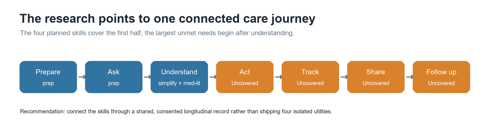
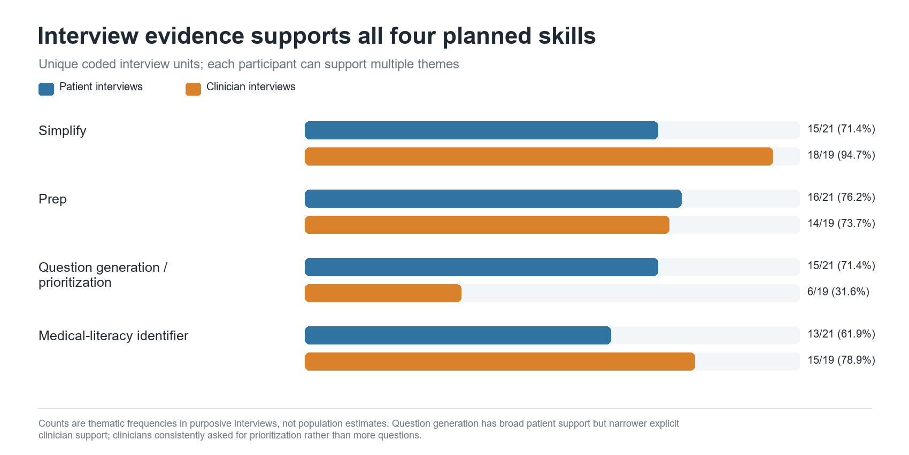
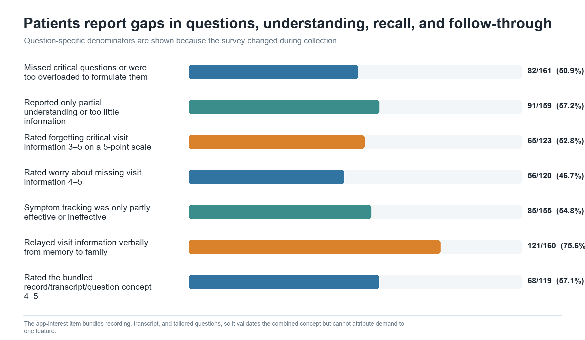
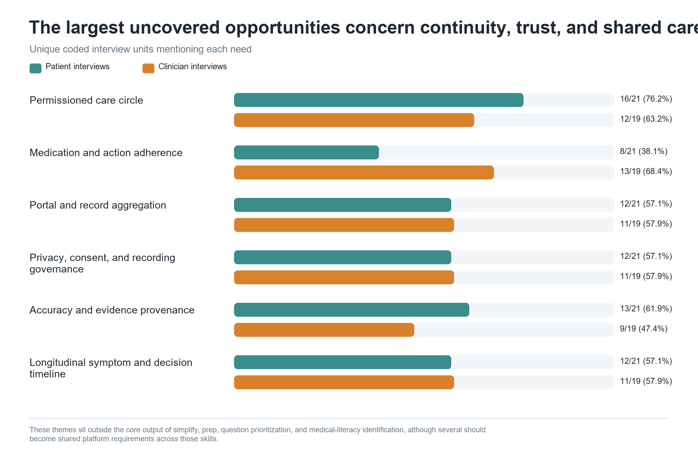
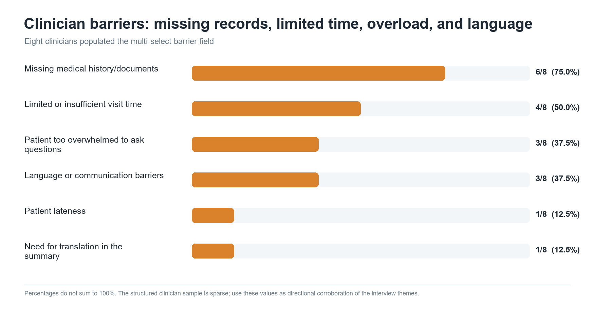

# User research: evidence for the current skills and the next product layer

## Executive conclusion

The connected research strongly supports the current direction: `simplify`,
appointment `prep`, question generation/prioritization, and an individual
medical-literacy profile. The evidence is not simply that people like the
idea. Patients describe missed questions, partial understanding, overload,
forgetting, and improvised preparation; clinicians independently describe the
same failures from the other side of the visit.

The more important strategic finding is that the four skills stop too early.
They help a person prepare and understand, but the largest uncovered needs are
to **act, track, share, and follow up**. The best product architecture is
therefore a connected, consented care journey rather than four isolated
utilities.

## Evidence base and what can actually be claimed

The accessible primary corpus contains:

| Source | Accessible records | Analysis population |
|---|---:|---:|
| Patient survey/interview sheet | 165 rows | 164 unique submissions after one exact duplicate |
| Interview-tagged records inside that sheet | 22 rows | 21 unique coded interview units |
| Separate long-form patient/caregiver form | 4 rows | 4 response records; not cross-file deduplicated |
| Clinician sheet | 21 rows | 20 exact unique response records; 19 thematic units after combining one continuation |

This is smaller than the recalled fieldwork total of 200–300 surveys, 50 user
interviews, and 30–50 clinicians. The conclusions below describe the connected
corpus, not the larger recalled sample. Counts are question-specific because
the patient questionnaire changed during collection. Interview counts are
theme frequencies in a purposive sample, not population prevalence.

Primary sources:

- [Patient survey and interview responses](https://docs.google.com/spreadsheets/d/1sSSo_FuikAfjAVb6Lc0L8hlxNyFY_Go9_4qVmDGvLBM/edit)
- [Clinician responses](https://docs.google.com/spreadsheets/d/1IYGhg7QleCuXmskUatl28-I-xBD-cMxeVKsjSP4zDxE/edit)
- [Four additional long-form patient/caregiver interviews](https://docs.google.com/spreadsheets/d/1V1wd-FOJdwuaMUajr430MmvDHlbUWPcuhFRKGXaCFh0/edit)
- [Project 1 folder](https://drive.google.com/drive/folders/1lNxu3Ofwe68eoD6Fqj_-XwRrgFBkbvpi)

---

# Part 1 — Evidence supporting the four current capabilities

## 1. Simplify: the strongest cross-audience signal

| Evidence | Result |
|---|---:|
| Patient interviewees describing overload or recall failure | **15/21 (71.4%)** |
| Clinician units describing need for concise visit information | **18/19 (94.7%)** |
| Survey respondents reporting partial understanding or too little information | **91/159 (57.2%)** |
| Survey respondents rating forgetting at 3–5 | **65/123 (52.8%)** |
| Survey respondents relying on memorization | **78/163 (47.9%)** |
| Survey respondents wanting a transcript rather than audio alone | **22/143 (15.4%)** |
| Survey respondents saying long recordings are hard to search | **29/143 (20.3%)** |

Representative excerpts:

> “I kind of go dumb when they start talking.”  
> — Patient sheet, row 155

> “I forgot all the technical terms.”  
> — Patient sheet, row 91

> “I often feel overwhelmed with the amount of information shared.”  
> — Patient sheet, row 166

> “Medications talked about, next steps, when to follow up.”  
> — Clinician sheet, row 6

What this validates: the useful output is not a transcript dump. It is a
layered, searchable summary with decisions, medication changes, next actions,
timelines, warning signs, unresolved questions, and expandable source detail.

What the feedback constrains:

- Keep it terse. A clinician said, “For me to write three lines is faster than
  reviewing four lines for errors” (clinician row 4).
- Preserve clinical control where required. “It would have to be a must that
  we see the summary” (clinician row 5).
- Do not imply completeness when records or audio are missing.

## 2. Question generation should be question prioritization

| Evidence | Result |
|---|---:|
| Patient interviewees whose questions were missed or emerged later | **15/21 (71.4%)** |
| Clinician units explicitly asking for question support/prioritization | **6/19 (31.6%)** |
| Survey respondents who missed critical questions or were too overloaded to formulate them | **82/161 (50.9%)** |
| Survey respondents who contacted the clinician again after the visit | **89/154 (57.8%)** |
| Survey respondents using Google/ChatGPT for post-visit questions | **44/154 (28.6%)** |
| Bundled recording/transcript/question concept rated 4–5 | **68/119 (57.1%)** |

Representative excerpts:

> “Sometimes I can’t think of the questions at the time.”  
> — Patient sheet, row 43

> “I go in with a list of questions, but often forget while listening.”  
> — Patient sheet, row 150

> “What are your top three questions?”  
> — Clinician sheet, row 5

What this validates: generate an editable shortlist tied to the person’s
symptoms, records, goals, and uncertainty.

What the feedback changes: unlimited brainstorming can worsen overload and
consume visit time. Rank questions into:

1. Must ask today.
2. Ask if time permits.
3. Safe for portal or later follow-up.

The concept-interest question bundles three capabilities, so it validates the
combined concept but cannot isolate question-generation demand.

## 3. Prep: users are already doing the work, but in fragments

| Evidence | Result |
|---|---:|
| Patient interviewees mentioning preparation through questions, research, histories, symptoms, or support | **16/21 (76.2%)** |
| Clinician units describing a preparation need | **14/19 (73.7%)** |
| Survey respondents searching before the appointment | **123/158 (77.8%)** |
| Clinicians selecting missing history/documents as a major barrier | **6/8 (75.0%)** |
| Clinicians selecting limited visit time as a barrier | **4/8 (50.0%)** |

Representative excerpts:

> “What to expect beforehand, what to ask.”  
> — Patient sheet, row 157

> “I write everything down ahead of time to remember it going into the appointment.”  
> — Patient survey, row 54

> “Written medication list, questions and concerns, recent vital signs.”  
> — Clinician sheet, row 2

> “A thousand pages, but only two usable ones.”  
> — Clinician sheet, row 4

What this validates: preparation should assemble the right information, not
merely ask generic intake questions. The output should be a one-page visit
brief containing the purpose of the visit, symptom timeline, medication list,
relevant results/documents, top questions, and accommodation or caregiver
needs.

What the feedback constrains: import and improve existing notes and trackers;
do not make users re-enter the same information into another disconnected app.

## 4. Medical-literacy identification must be situational and respectful

| Evidence | Result |
|---|---:|
| Patient interviewees describing difficulty with terminology, results, or instructions | **13/21 (61.9%)** |
| Clinician units describing literacy, cognition, language, stress, or desired-depth differences | **15/19 (78.9%)** |
| Survey respondents with partial understanding or too little information | **91/159 (57.2%)** |
| Survey respondents rating online search reliability only 1–3 | **81/153 (52.9%)** |
| Later-version respondents reporting English was not their first language | **13/54 (24.1%)** |

Representative excerpts:

> “Understanding results, what they mean.”  
> — Patient sheet, row 150

> “Show me the citations from research.”  
> — Patient sheet, row 63

> “Depends on education level, medical literacy, anxiety, cognitive status.”  
> — Clinician sheet, row 2

> “Everyone comes from a different starting point.”  
> — Clinician sheet, row 10

What this validates: explanation depth, terminology, format, and evidence
should adapt to the individual.

What the feedback changes: do not label a person “low literacy,” and do not use
language or education as a proxy. Assess encounter-specific needs:

- familiarity with the condition and terminology;
- preferred detail and format;
- confidence explaining the plan back;
- pain, anxiety, cognitive load, hearing, and language needs;
- ability to execute the instructions;
- desire for citations or source detail.

## Overall verdict on the four capabilities

| Capability | Evidence verdict | Important product refinement |
|---|---|---|
| Simplify | Strongest cross-audience support | Structured, concise, source-linked output; not transcript-first |
| Prep | Strong support from both groups | Select relevant records and produce a one-page agenda |
| Questions | Strong patient need; narrower explicit clinician support | Prioritize roughly three clinically relevant questions |
| Medical literacy | Strong support | Dynamic communication profile, not a stigmatizing score |

---

# Part 2 — Pain points not covered by the four capabilities

The interview coding points to a second product layer. Some items are good
candidate skills; others are platform requirements that every skill must obey.

## Priority 1. Permissioned care circle

**Ask:** Let a trusted person help prepare, attend remotely, see an appropriate
summary, add questions, and support the next steps—without automatically seeing
everything.

Evidence:

- **16/21 patient interview units** and **12/19 clinician units** raised care
  partner or proxy needs.
- **121/160 survey respondents (75.6%)** relayed visit information verbally
  from memory to family.
- **59/112 caregiver-field respondents (52.7%)** reported only partial or
  ineffective information capture.
- All **4/4 long-form interviews** involved receiving or providing appointment
  support; in **3/4**, a support person wanted to attend but could not.

Excerpts:

> “My family will have follow-up questions.”  
> — Patient sheet, row 150

> “I feel better knowing someone else is there to absorb information.”  
> — Long-form interview sheet, row 2

> “Presence or engagement of a care partner is instrumental.”  
> — Clinician sheet, row 6

Suggested development: a `care-circle` capability with granular, revocable,
encounter-specific permissions; delegated prep; shared action items; remote
attendance; and separate patient/caregiver views.

Critical constraint: direct caregiver discovery is still missing. The caregiver
outreach sheet contains prospects, not completed caregiver interviews. Conduct
a dedicated caregiver study before final workflow design.

## Priority 2. Medication and action-plan execution

**Ask:** Turn the visit outcome into confirmed medications, exercises, tests,
referrals, deadlines, and follow-ups—and help the patient complete them.

Evidence:

- **8/21 patient interview units** and **13/19 clinician units** raised action,
  medication, or adherence problems.
- One of the four long-form participants repeatedly forgot physical-therapy
  homework.
- Clinicians distinguished remembering information from executing it.

Excerpts:

> “Maybe they remember but do not execute the plan.”  
> — Clinician sheet, rows 15–16

> “What are you taking… and why are you taking it?”  
> — Clinician sheet, rows 19/21 duplicate pair

Suggested development: an `act` or `care-plan` capability that extracts only
confirmed instructions, asks the user to acknowledge them, schedules reminders,
tracks completion, and escalates unresolved medication discrepancies.

Critical constraint: it must never independently prescribe, change dosage, or
infer that a missed check-in means clinical stability.

## Priority 3. Longitudinal record and clinically useful timeline

**Ask:** Keep symptoms, medications, photos, decisions, labs, images, and open
questions connected across visits and portals.

Evidence:

- **12/21 patient interview units** and **11/19 clinician units** raised
  longitudinal tracking or interoperability needs.
- Missing medical history/documents was selected by **6/8 clinicians** who
  answered the barrier question.
- Three of four long-form responses described fragmented or lost records.

Excerpts:

> “Documentation between visits.”  
> — Patient sheet, row 161

> “Multiple apps / portals have my medical data.”  
> — Long-form interview sheet, row 3

> “Report is only a statement; need to see the image.”  
> — Clinician sheet, row 6

Suggested development: a shared `timeline` or `records` service that imports
documents, retains source links and dates, detects duplicates, separates current
from historical information, and sends the relevant subset into `prep` and
`simplify`.

Critical constraint: collection is not the same as relevance. Clinicians
explicitly rejected large undifferentiated record dumps.

## Priority 4. Closed-loop clarification and safe escalation

**Ask:** Answer post-visit questions from the actual encounter record, package
what remains unresolved, and route only appropriate questions to the care team.

Evidence:

- **89/154 survey respondents (57.8%)** used the standard “reach out to the
  doctor again” response.
- **70/154 (45.5%)** used the standard “note it down for next appointment”
  response.
- **44/154 (28.6%)** used the standard Google/ChatGPT response.
- **12/21 patient interview units** raised portal/follow-up continuity, and
  **11/19 clinician units** raised between-visit actions or message triage.

Suggested development: a `follow-up` capability that first answers from the
source record, distinguishes education from medical advice, tracks unanswered
items, creates a concise portal-ready message, and directs urgent concerns to
appropriate care.

Critical constraint: a poorly bounded tool will increase clinician workload.
Response expectations, emergency boundaries, and routing rules must be explicit.

## Priority 5. Symptom and health-event journal

**Ask:** Make it easy to capture a symptom when it happens and turn scattered
entries into a trend the clinician can use.

Evidence:

- **85/155 survey respondents (54.8%)** said their tracking method was only
  partly effective or ineffective.
- **27 unique survey records** explicitly reported not keeping track or being
  unable to keep track.
- All **4/4 clinicians** answering the symptom-log question called it “Very
  helpful.”
- The broader timeline need appeared in **12/21 patient** and **11/19
  clinician** interview units.

Excerpts:

> “It would be better to keep a more detailed list of symptoms. This day this happened…”  
> — Patient survey, row 162

> “Cannot keep track of it due to executive dysfunction even when I try.”  
> — Patient survey, row 163

Suggested development: a `track` capability with quick voice/text capture,
severity, time, trigger, medication context, optional photos, trend detection,
and a concise export into the next appointment brief.

## Priority 6. Grounded research and evidence provenance

**Ask:** Help patients research without pushing them toward irrelevant,
outdated, or frightening conclusions.

Evidence:

- **123/158 survey respondents (77.8%)** searched before appointments.
- **45/56 later-version respondents (80.4%)** searched after appointments.
- **81/153 (52.9%)** rated search reliability only 1–3.
- Evidence, source, or accuracy concerns appeared in **13/21 patient** and
  **9/19 clinician** interview units.

Excerpts:

> “Show me the citations from research.”  
> — Patient sheet, row 63

> “Results are all over the place. Don’t trust Google AI.”  
> — Patient survey, row 153

> AI can be “over inclusive” and “has to be succinct.”  
> — Clinician sheet, rows 2 and 10

Suggested development: a `research` capability grounded in the patient’s
documents and question, with dated citations, evidence-quality cues,
uncertainty, and a clear boundary against confirming or rejecting diagnoses.

## Priority 7. Translation, accessibility, and cognitive-load modes

**Ask:** Deliver the same confirmed information in a language and format the
person can reliably understand and use.

Evidence:

- Translation/accessibility needs appeared in **8/19 clinician units**.
- Five patient interview/survey accounts explicitly described anxiety, pain,
  overload, or executive-function barriers.
- **13/54** later-version survey respondents reported English was not their
  first language, although most reported understanding English well.

Suggested development: make this a cross-cutting delivery layer—preferred
language, read-aloud, large text, low-cognitive-load mode, repetition, and
interpreter-aware preparation—rather than a demographic literacy shortcut.

Critical constraint: automated translation does not replace a certified
medical interpreter where one is required.

## Priority 8. Advocacy, discrepancy, and second-opinion packet

**Ask:** Help a patient document conflicting explanations, changed notes,
incorrect history, or unresolved concerns when seeking another opinion.

Evidence:

- **9/21 patient interview units** explicitly raised advocacy, discrepancies,
  or second-opinion needs.
- Users described conflicting clinicians, changed notes, and the desire for a
  representative.

Suggested development: an optional `advocate` mode that creates a factual,
source-linked discrepancy log and a portable second-opinion packet. This should
be an escalation feature, not the default framing of every encounter.

## Platform requirements, not separate skills

Two highly frequent needs should shape every capability:

1. **Privacy, consent, and recording governance** — raised by **12/21 patient**
   and **11/19 clinician** interview units. In the survey, **53/143 (37.1%)**
   said asking to record felt socially awkward, **14/143 (9.8%)** cited privacy,
   and nine respondents reported refusal.
2. **Accuracy, provenance, and clinician workload control** — raised by
   **13/21 patient** and **9/19 clinician** units. Source links, uncertainty,
   concise output, editability, and clear authorship are foundational.

The finding is not that recording is rejected. Acceptance is conditional on
consent, setting, policy, transparent downstream use, and a useful non-recording
fallback.

## Recommended sequence

| Sequence | Product move | Why now |
|---:|---|---|
| 1 | Finish `simplify`, `prep`, prioritized questions, and situational `med-lit` | Directly supported by both audiences |
| 2 | Add shared action-plan and follow-up state | Closes the gap between understanding and execution |
| 3 | Add longitudinal symptom/record timeline | Supplies durable context to every skill |
| 4 | Add permissioned care-circle access | Highest uncovered patient theme and strong clinician support |
| 5 | Add grounded research and accessibility delivery layers | Reduces unsafe independent search and broadens usability |
| 6 | Explore advocacy and insurance navigation | Advocacy has moderate support; insurance evidence is currently thin |

## Product and research implications

- The durable product object should be a consented longitudinal record shared
  across skills, not separate one-off outputs.
- Question generation is valuable only when tied to relevance and visit-time
  constraints.
- Medical literacy should be treated as a changing communication need, not a
  permanent user label.
- Caregiver functionality has strong indirect evidence but needs direct
  caregiver research.
- Test the new skills separately. The current concept question bundles
  recording, transcript, and questions and therefore cannot estimate
  feature-level demand.
- Measure outcomes beyond stated interest: time to prepare, top-question
  completion, teach-back comprehension, action completion, unresolved
  questions, clinician review time, and avoidable repeat messages.

## Method and limitations

- Structured metrics use unique patient submissions and nonblank,
  question-specific denominators.
- Multi-select percentages can sum above 100%.
- Interview coding is multi-label; one participant can support several themes.
- Patient qualitative counts use 21 unique Interview-tagged records after one
  duplicate. Clinician qualitative counts use 19 thematic units.
- The separate four long-form records were not cross-file deduplicated because
  doing so would require PII.
- Most patient recruitment came through Reddit, the sample had high
  chronic-care exposure, and smartphone comfort was high.
- Clinician structured fields are sparse—usually one to eight answers—so they
  are directional corroboration, not prevalence estimates.
- Scale endpoints were unavailable in the export. Thresholds such as 4–5 are
  reported without assigning stronger semantic labels than the question allows.
- All evidence is self-reported; no clinical outcome claim is made.

## Security note

The Drive corpus contains personal contact fields, and an operational tracker
contained values that appeared to be live credentials. No raw exports or
credentials are included here. Those credentials should be rotated/revoked and
the tracker permissions reviewed immediately.

## Reproducibility

Inspectable outputs:

- [`data/metrics.csv`](data/metrics.csv)
- [`data/current_skill_support.csv`](data/current_skill_support.csv)
- [`data/unmet_needs.csv`](data/unmet_needs.csv)
- [`data/evidence_ledger.csv`](data/evidence_ledger.csv)
- [`data/source_inventory.csv`](data/source_inventory.csv)
- [`data/data_quality.csv`](data/data_quality.csv)
- [`data/analysis_snapshot.json`](data/analysis_snapshot.json)
- [`scripts/analyze_user_research.py`](scripts/analyze_user_research.py)
- [`scripts/validate_research_outputs.py`](scripts/validate_research_outputs.py)
